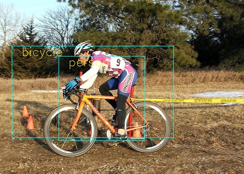
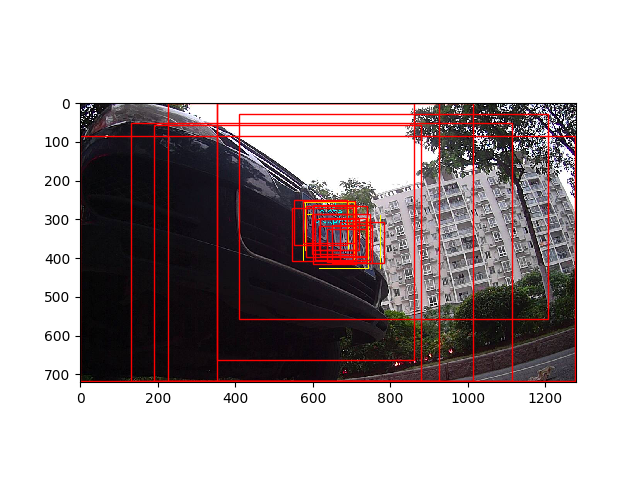

# thunderNet的简单实现demo
## 依赖
- [x] cuda
- [x] python3
- [x] pytorch1.3
- [x] visdom
## 结构
* model.py &nbsp; shufflev2,CEM,SAM,RPN以及subnet模块的模型定义
* net.py &nbsp;  thunderNet模型的定义以及训练过程
* common.py &nbsp; roi选择，iou计算，anchorbox生成以及损失函数计算等操作
* cpp/* &nbsp; 用来实现psroi操作，需要gpu的支持
* tools.py &nbsp; 封装psroi操作为pytorch中的模块
* config.py &nbsp; 参数设置文件
## 训练(voc数据集)
1. 利用script下的文件xml2txt.py文件生成训练标签和测试标签，标签格式如下：

```文件路径| 标记框个数|第一个标记框类别 标记框右上角坐标(x,y) 标记框左下角坐标(x,y)|..... ```

2. 修改net.py的main函数的root，train，val为自己的路径
3. 运行 `python3 -m visdom.server `和`python3 net.py `

## 效果


这是voc2007+2012数据集上训练的模型效果图，没有在imageNet数据集上预训练，而是从零开始在voc数据集上训练的，性能不是很好，训练过程中rpn损失收敛比较快，但是subnet部分收敛好慢，发生震荡


将thunderNet用于号牌检测，没有多余的调参和特别的设置anchor，号牌检测的整体性能都挺不错的，上图红色的是rpn阶段得到的建议框，黄色部分是预测的结果
## 结尾
代码写的不太好，但是这也是这两个星期的成果吧，如果对代码有疑问请邮件tao2012abc@163.com